# Assignment #2 — Advanced CSS (Flexbox & Grid)

**Name:** Avirup Roy

**Group:** IT-2513

**Live Site:** https://aviruproyneal.github.io/assignment2_webtech/

---

## Objective

This assignment was about building layouts with Flexbox and CSS Grid instead of floats. The goal was to get comfortable with alignment, spacing, and combining both systems on one page.

---

## Part 1: Flexbox

### Task 0: Navigation Bar

I created a header with a logo on the left and a list of links on the right. The `.navbar` is a flex container with `justify-content: space-between` to push the two apart, and `align-items: center` to line them up vertically. The links use `gap: 25px` for spacing, and the logo has `flex-shrink: 0` so it never squishes when the window gets narrow.

**Screenshot:**

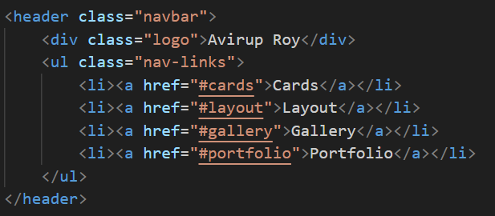
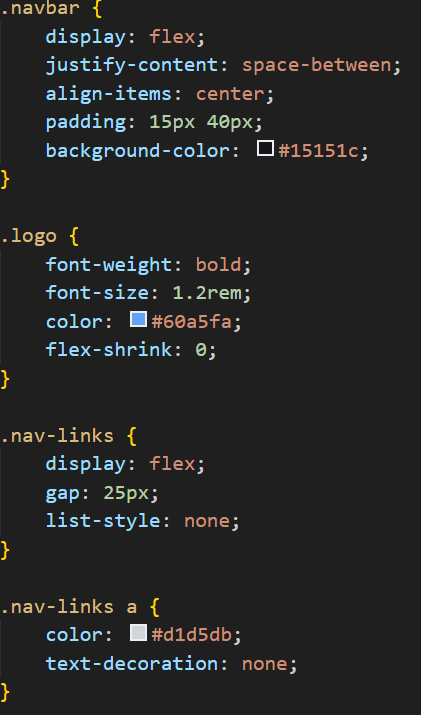
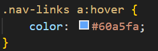

### Task 1: Card Row

I made a row of three cards, each with an image, title, text and a button. The `.card-row` is a flex container with `flex-wrap: wrap` so the cards wrap when the screen shrinks. Each card uses `flex-grow: 1`, `flex-shrink: 1`, and `flex-basis: 220px` so they share the row evenly. Inside each card, I use another flex container stacked in a column. The button has `align-self: flex-start` so it doesn't stretch to the full width of the card, and one card uses `order: -1` to appear first even though it comes second in the HTML.

On hover, the card scales up slightly using `transform: scale(1.03)`.

**Screenshot:**

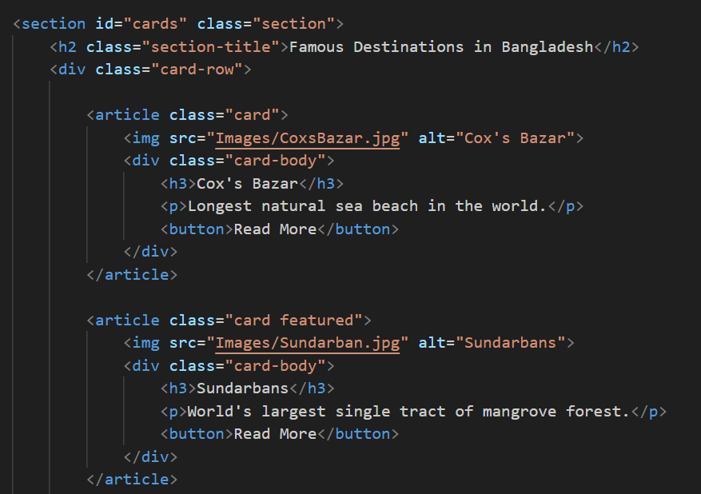
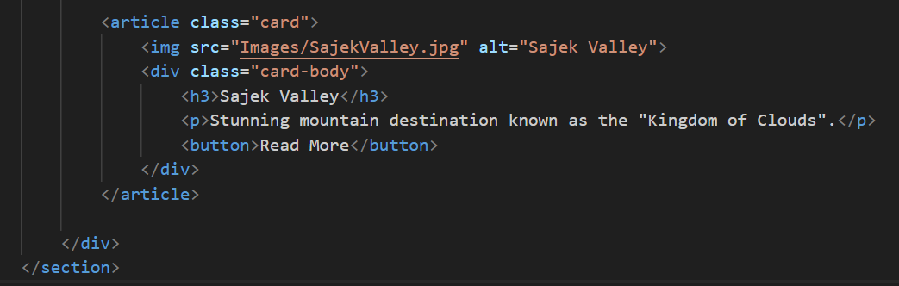
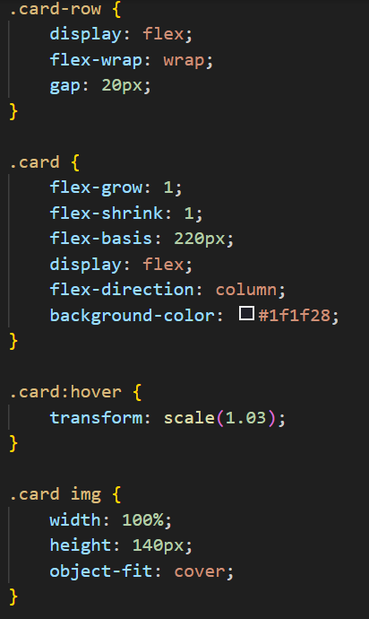
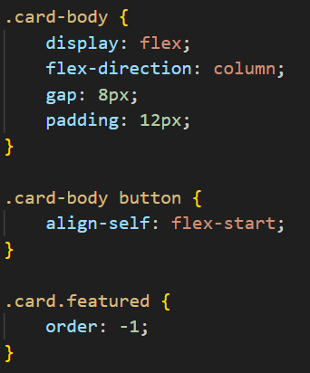
---

## Part 2: Grid System

### Task 2: Page Layout with Grid

I set up a layout with header, sidebar, main content and footer. The `.grid-layout` uses `grid-template-areas` to define the layout as a visual map: the header spans the top, sidebar and main sit in the middle, and the footer spans the bottom. Each section then just uses `grid-area` to say which named area it belongs to. The sidebar column uses `min-content`, so it's only as wide as its content needs, and the sidebar itself uses `align-self: start`, so it doesn't stretch to fill the whole row.

**Screenshot:**
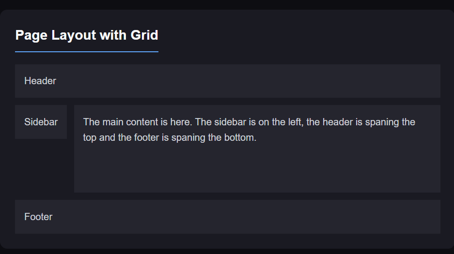
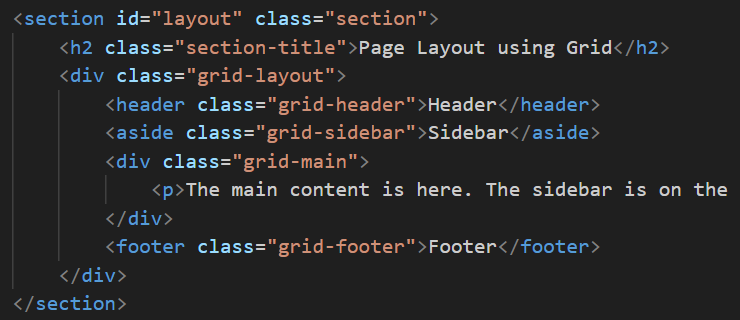
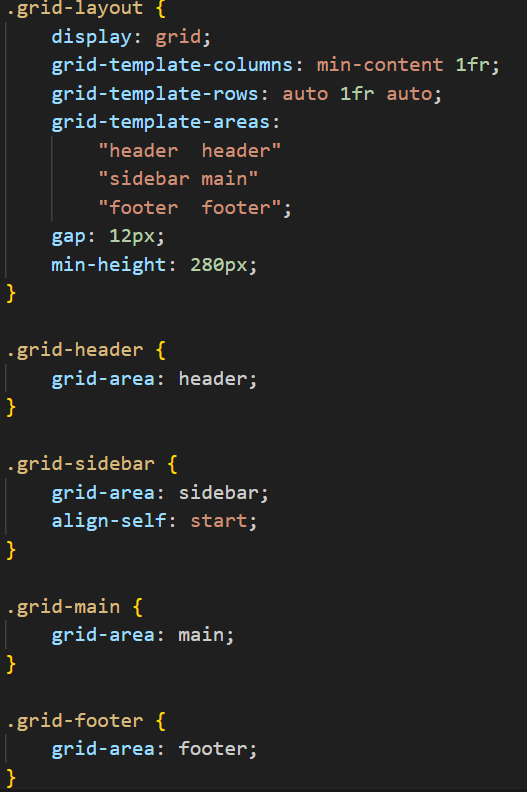
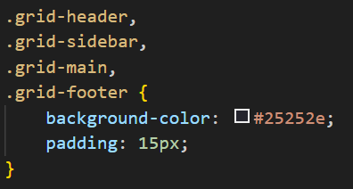

### Task 3: Image Gallery

I built a gallery of 9 images inside a grid container. The grid uses `repeat(4, 1fr)` for the columns and `repeat(3, 140px)` for the rows, with `row-gap` and `column-gap` for spacing. One image has the `.featured` class and uses `grid-column: 1 / 3` and `grid-row: 1 / 3` to take up a 2×2 block of cells. `justify-self: stretch` makes it fill its area. Each image has a caption overlay that fades in on hover.

**Screenshot:**

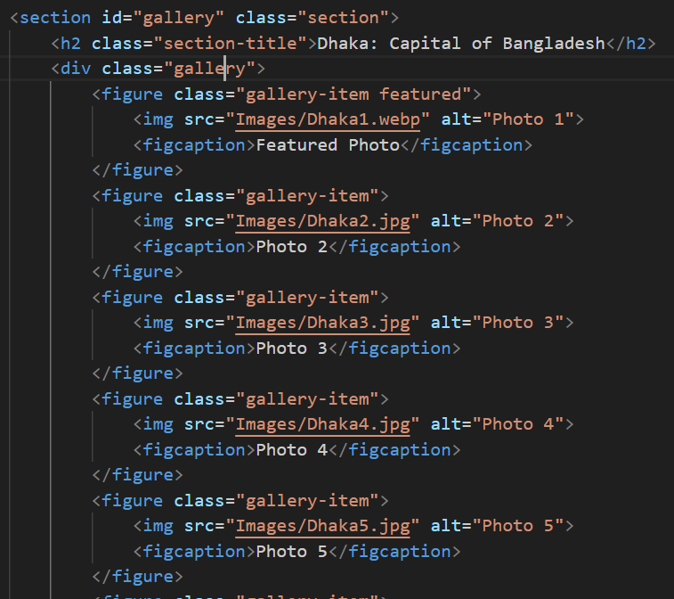
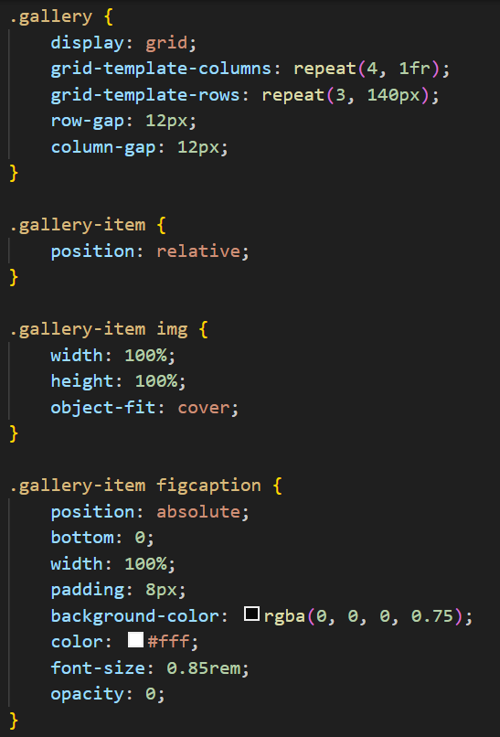
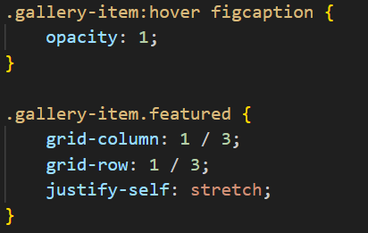
---

## Part 3: Combining Flexbox & Grid

### Task 4: Portfolio Page

I made a portfolio layout with header, projects area, sidebar and footer. The whole thing uses CSS Grid with `grid-template-areas` to lay out the four sections and `grid-template-columns: minmax(0, 1fr) fit-content(200px)`, so projects get flexible width and the sidebar fits its content. The header uses Flexbox for the nav (logo + links) and each project card uses Flexbox to put the info on the left and the button on the right. Inside the sidebar, a small inner grid uses `max-content` for the label column so labels only take the space they need.

**Screenshot:**

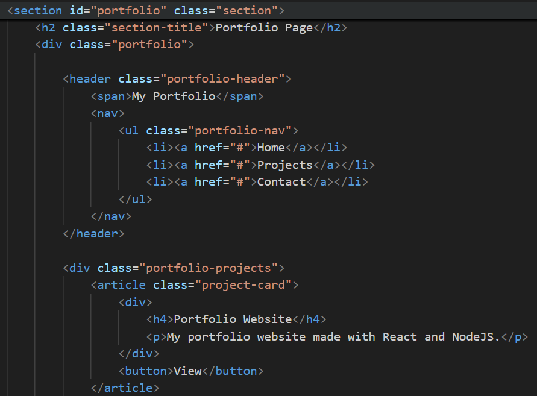
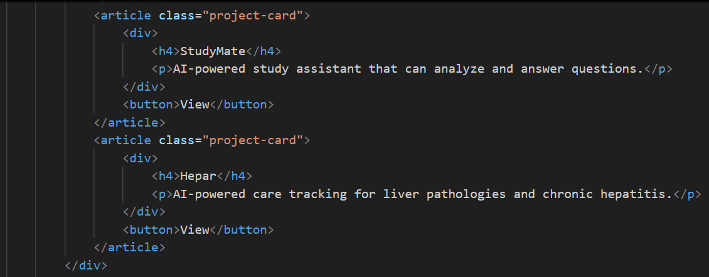
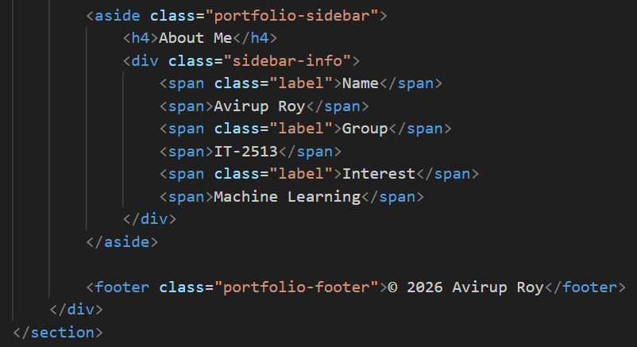
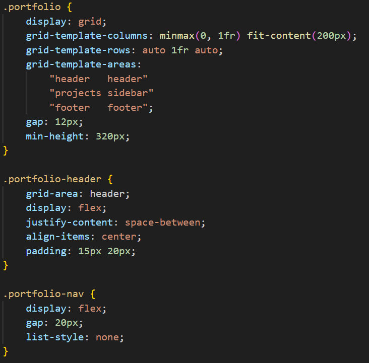
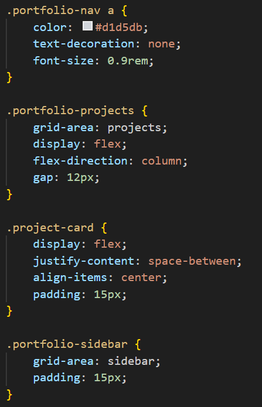
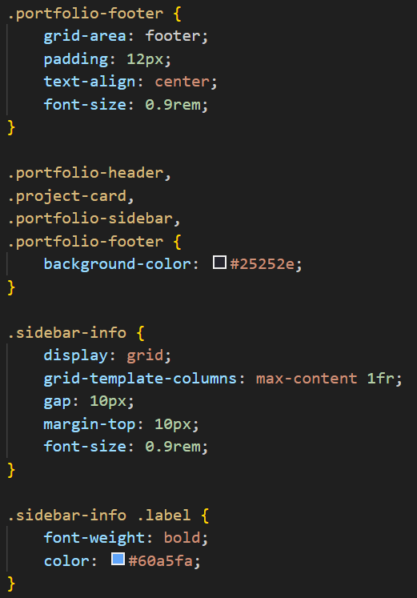

### Site Footer (Grid Alignment)

The bottom of the page has a row of tech-stack badges. It uses `grid-template-columns: repeat(4, 120px)` and demonstrates four grid alignment properties together — `justify-content: center` centers the whole grid horizontally, `justify-items: center` centers each badge inside its cell, `align-content: center` centers the row vertically, and `align-items: center` centers each badge vertically.

**Screenshot:**

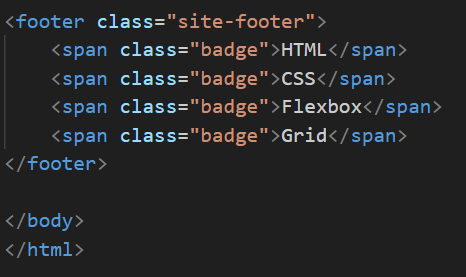
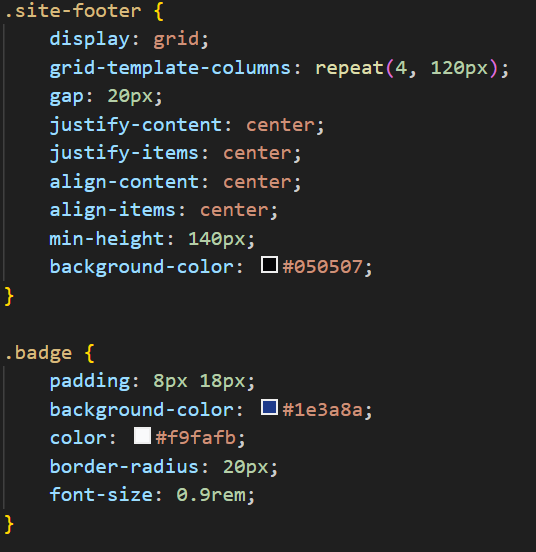

---

## Summary

The main thing I learned from this assignment is when to use Flexbox vs. Grid. Flexbox works well for one-direction layouts like the navbar, the card row, and the internals of a project card. Grid is better when you need control over rows and columns at the same time, like the page layout, the gallery, and the portfolio.

The trickiest part was the sizing units. `min-content`, `max-content`, `minmax()`, and `fit-content()` all behave a little differently. I had to test each one to see how they actually shrink or grow a column. The gallery with the featured image spanning a 2×2 block also took a bit of math to get the total cells right.

`grid-template-areas` turned out to be my favorite part. Writing the layout as a visual map — `"sidebar main"` — is much easier to read than placing items by line numbers, especially when there are four sections to manage.
